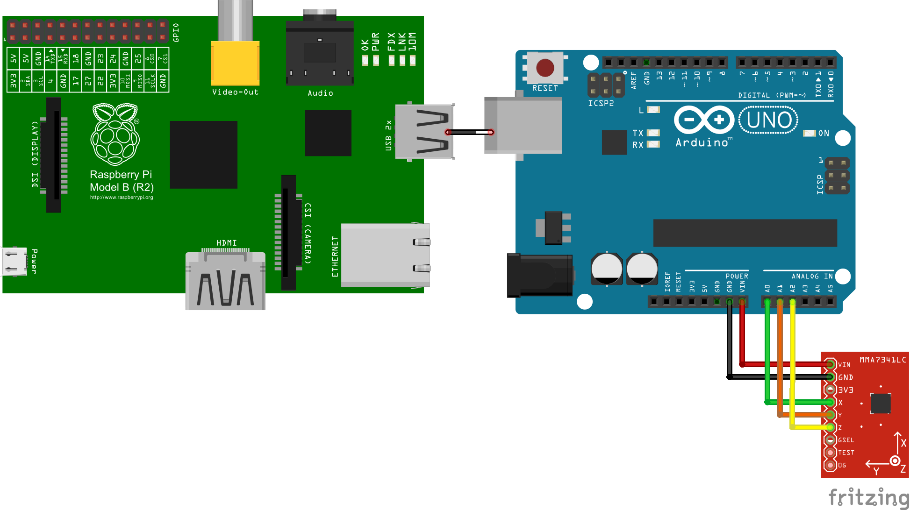

# Innoweek 2015 - Logistics Team (Hardware Application)

[](https://gitter.im/armbrustsamuel/logistics_hardware?utm_source=badge&utm_medium=badge&utm_campaign=pr-badge&utm_content=badge)
[](https://jam4.sapjam.com/groups/YY7skDYos93atGxqo6W8ZS/content?folder_id=OL1EEbH5syzdyhzykqnuHv)

Embedded telemetry application, to collect and upload vehicles hardware information to SAP HANA data analysis server.

##How to run

To run the application on you Raspeberry Pi you need to...

###Install Raspbian

To install the Rasbian OS on your SD card, you can follow these [instructions](https://www.raspberrypi.org/documentation/installation/installing-images/).


###Install Peripheral Hardware


###Install Node.js

The Node.js can be installed using the build of [node-arm](http://node-arm.herokuapp.com/).
To avoid incompatibility errors, we will use a more stable version instead of the latest.

```sh
sudo apt-get update
wget http://node-arm.herokuapp.com/node_0.10.36_armhf.deb
sudo dpkg -i node_0.10.36_armhf.deb
# Check installation
node -v
```
The NPM installation can be done using the package manager, but it need to be updated.

````sh
sudo apt-get install npm
sudo npm install npm -g
npm -v
```

###Clone Repository

To clone the repository from github on raspberry shell execute:

```sh
git clone https://github.com/armbrustsamuel/logistics_hardware.git && cd logistics_hardware
```

###Build and run the application

Once you have the application source on your local machine, you need to build it for a first time to download all npm dependencies.
The --unsafe-perm is necessary to properly install the serialport package.

```sh
npm install --unsafe-perm
```

To run the application, use npm start.

```sh
npm start
```